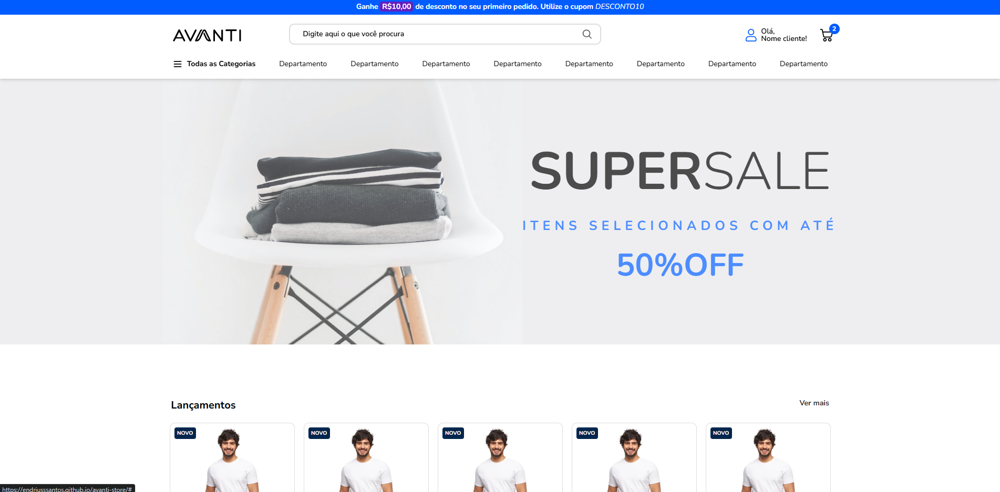

# Loja Virtual Avanti - Layout

Este projeto tem como objetivo criar o layout de uma loja virtual com base em um modelo fornecido no **Figma**. A aplicação é desenvolvida com **HTML**, **Tailwind CSS** e utiliza **JavaScript** para funcionalidades interativas, como o carrossel de produtos e a navegação.

🔗 **Acesse o projeto online:** [GitHub Pages](https://endriusssantos.github.io/loja-virtual-avanti-layout/)

## 🚀 Tecnologias utilizadas

- HTML
- Tailwind CSS (via CDN)
- JavaScript (Vanilla JS)
- GitHub Pages (para deploy)

## 💡 Funcionalidades

- **Carrossel de Produtos**: Exibição de produtos com setas de navegação.
- **Botões interativos**: Botões para adicionar/remover produtos, ajustar quantidades, e simular a compra.
- **Layout Responsivo**: O layout se adapta a diferentes tamanhos de tela.
- **Seções de Produtos**: Exibição de diferentes categorias de produtos com imagens e descrições.
- **Barra de Navegação**: Menu dropdown para navegação entre seções.
- **Botão de Scroll para o Topo**: Um botão flutuante no canto da tela para retornar ao topo da página.

## 📸 Demonstração



## 📦 Instalação local

1. Clone o repositório:
   ```bash
   git clone https://github.com/endriusssantos/loja-virtual-avanti-layout

2. Acesse a pasta do projeto:
   ```bash
   cd loja-virtual-avanti-layout

3. Abra o arquivo `index.html` no seu navegador para visualizar o layout

## ✍️ Autor

Desenvolvido por Endrius da Silva dos Santos